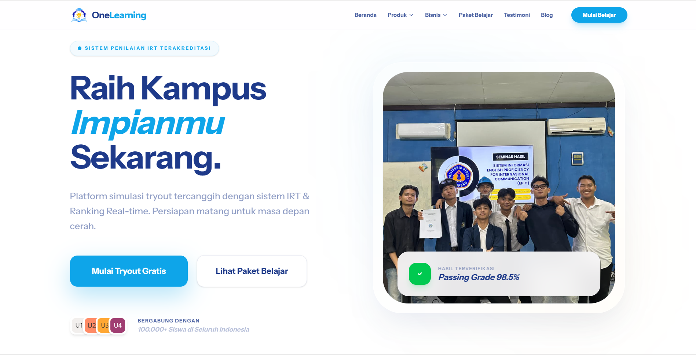

# OneLearning Platform

## Deskripsi Platform

OneLearning adalah platform simulasi tryout mutakhir yang mengimplementasikan sistem penilaian IRT (Item Response Theory) dan Ranking Real-time. Platform ini dirancang secara khusus untuk memfasilitasi siswa di Indonesia dalam menghadapi berbagai tingkatan ujian nasional, mulai dari jenjang SD, SMP, SMA, hingga persiapan seleksi masuk Perguruan Tinggi Negeri (UTBK/SNBT).

Sistem penilaian kami telah terkalibrasi untuk menghasilkan analisis kompetensi yang akurat. Dengan basis pengguna yang mencapai lebih dari 100.000 siswa, OneLearning berkomitmen menjadi mitra strategis dalam mewujudkan impian pendidikan tinggi.

## Fitur Unggulan

### Penilaian IRT Terkalibrasi
Menggunakan algoritma pembobotan soal dinamis berdasarkan tingkat kesulitan, selaras dengan standar seleksi nasional terkini.

### Pemeringkatan Nasional Real-time
Sistem rangking otomatis yang memberikan gambaran posisi peserta secara nasional segera setelah sesi ujian berakhir.

### Prediksi Kelulusan SNBP
Analisis prediktif berbasis data nilai dan statistik universitas untuk membantu siswa memetakan peluang di berbagai program studi.

### OneBot AI Assistant
Integrasi Google Gemini AI sebagai asisten akademik untuk konsultasi materi dan bantuan teknis penggunaan platform secara langsung.

### Sertifikat dan Laporan Hasil
Penerbitan sertifikat digital otomatis dengan ID Verifikasi unik serta laporan detail per mata pelajaran.

## Daftar Paket Simulasi

Platform menyediakan berbagai paket simulasi yang telah diperbarui dengan 50 soal per kategori:

### Jenjang SD
- Simulasi Matematika Dasar SD
- Tryout IPA Terpadu SD
- Paket Lengkap Asesmen Nasional SD

### Jenjang SMP
- Simulasi Bahasa Inggris SMP
- Tryout Matematika & IPA SMP
- Paket Intensif Ujian Sekolah SMP

### Jenjang SMA (Kelas 10-12)
- Simulasi Fisika Dasar SMA
- Tryout Biologi & Kimia SMA
- Paket Sukses Kenaikan Kelas SMA

### Persiapan UTBK & Alumni
- Simulasi TPS Kilat SMA 12
- Tryout Soshum/Saintek SMA 12
- Mastery Pack SMA 12 & UTBK
- Simulasi Re-start UTBK Alumni
- Tryout Spesialis Ujian Mandiri Alumni
- Ultimate Alumni Strategy Pack

## Spesifikasi Teknis

### Stack Teknologi
- Framework: Laravel 12
- Database: MySQL (Optimized Indexing)
- Frontend: Tailwind CSS, Alpine.js, Blade
- AI: Google Gemini API Integration
- Payment: Midtrans Payment Gateway

### Arsitektur
- Database Polimorfik: Digunakan untuk struktur Bank Soal dan Submission guna efisiensi skema.
- Keamanan: Implementasi Rate Limiting dan proteksi CSRF pada seluruh rute kritis.
- Caching: Optimasi performa pada data statistik dashboard.

## Panduan Instalasi

1. Lakukan clone pada repositori ini.
2. Jalankan perintah `composer install` untuk dependensi PHP.
3. Jalankan perintah `npm install && npm run build` untuk aset frontend.
4. Salin `.env.example` menjadi `.env` dan sesuaikan konfigurasi database serta API Key (Midtrans & Gemini).
5. Jalankan `php artisan key:generate`.
6. Jalankan `php artisan migrate --seed` untuk menginisialisasi database beserta 50 soal tiap tryout.
7. Jalankan `php artisan storage:link`.

## Lisensi
Hak Cipta (c) 2026 OneLearning Indonesia. Seluruh hak cipta dilindungi.
